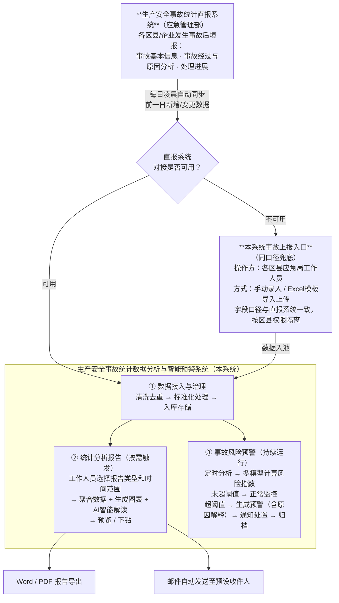

# 产品上下文 · 生产安全事故统计分析与智能预警系统

## 文档治理状态

| 字段 | 内容 |
|------|------|
| 来源依据 | 沈阳应急局需求文档、政策法规文件、项目协作文档 |
| 已确认事项 | 产品定位、角色定义、模块边界、设计原则 |
| 待确认事项入口 | [产品规划 AC 总表](./生产安全事故统计分析与智能预警系统产品规划.md#全局待确认总表ac) |
| 同步责任人 | PM（事故调查科） |
| 最后同步日期 | 2026-03-19 |

## 目录

- [说明](#说明)
- [产品定位](#产品定位)
- [商业模式](#商业模式)
- [政策背景](#政策背景)
- [用户角色](#用户角色)
- [组织架构](#组织架构)
- [术语表](#术语表)
- [核心业务流程](#核心业务流程)
- [模块清单](#模块清单)
- [数据底座](#数据底座)
- [设计原则](#设计原则)
- [功能规划原则](#功能规划原则)
- [对接系统](#对接系统)

---

## 说明

> 维护原则：只写 AI 设计功能时真正需要参考的内容，不写完整 PRD。
> 信息完整性优先，确保 AI 功能设计时有足够的背景支撑。

**文档定位**：本文档记录业务背景、政策要求、商业模式等变更频次不高的业务知识。
**配套文档**：[生产安全事故统计分析与智能预警系统产品规划.md](./生产安全事故统计分析与智能预警系统产品规划.md) 根据产品上下文的大模块拆分子功能，规划实施状态（已上线/待规划/待解决）。

**使用方式**：进行功能设计时，需同时读取本文档和产品规划文档，基于业务要求和规划状态设计新功能。

---

## 产品定位

**系统名称**：生产安全事故统计数据分析与智能预警系统

**核心定位**：作为应急管理部"生产安全事故统计信息直报系统"（沈阳账号）的本地"智能分析大脑"，优先对接国家直报系统获取数据；同时保留本系统事故上报入口（手动录入/导入上传）作为兜底，确保在接口不可用时业务连续，实现统计报告从人工到自动、安全监管从事后到事前预警的两大核心转变。

**治理/运营模式**：
- 政府委托项目，由沈阳市应急管理局事故调查科主导，部署于政务内网环境
- 系统独立运行，优先通过数据接口或页面抓取方式从国家直报系统获取沈阳范围内的事故数据；当对接不可用时，启用本系统上报入口进行手动录入或模板导入上传

**目标用户**：
- **事故调查科工作人员**：日常核心用户，负责生成和审核统计报告、处置预警
- **应急管理局领导**：报告受众，查看分析结论，接收重要预警通知
- **系统管理员**：配置预警模型、管理用户权限、维护系统运行

**核心场景**：
- **定期报告生成**：月末/季末/年末，工作人员一键生成标准格式统计报告，替代人工汇总
- **日常风险监控**：系统持续监测事故数据变化趋势，自动发出分级预警，工作人员及时处置
- **专项数据分析**：工作人员针对特定行业、特定区域进行下钻分析，支撑监管决策
- **外部部门自助查询**：交通局、消防、公安等有权限的外部部门用户，在系统中按权限范围自主查询本部门关联的事故统计数据，无需通过应急管理局人工提取
- **上报兜底保障**：国家直报系统接口不可用时，工作人员通过本系统同口径上报入口完成录入或导入上传，保障数据不断档

---

## 商业模式

**商业模式定位**：
- **项目定位**：政府采购项目，一次性交付建设
- **核心业务**：为政务安全监管场景提供数据智能分析能力
- **核心客户**：沈阳市应急管理局（甲方）
- **业务聚焦**：数据接入治理 + 报告自动生成 + 智能预警，三位一体

**收费模式**：
- **建设阶段**：按项目合同收取系统建设费用
- **运维阶段**：待补充（年度运维服务费模式待确认）

**核心价值主张**：
- **对应急管理局**：降低统计报告人工成本，将监管模式从事后响应升级为事前预防
- **对事故调查科工作人员**：减少重复性数据整理工作，提升报告质量和分析深度
- **对局领导**：提供更直观、更及时的安全态势感知，辅助监管决策

**战略原则**：不改变甲方原有直报业务流程，以数据分析增量价值为核心切入点

**核心竞争力与商业壁垒**：
- **壁垒本质**：深度理解政务安全监管业务逻辑，与甲方数据系统深度绑定
- **价值闭环**：
  - 对工作人员：减少重复工作 + 提升分析质量
  - 对管理层：事故态势可视化 + 预警提前介入
- **竞争力构建路径**：
  - **业务适配能力**（短期竞争力）：针对安全生产监管场景定制报告模板和预警规则
  - **历史数据积累**（长期壁垒）：系统沉淀多年事故数据后，预警模型准确率持续提升

**对功能设计的影响**：
- 所有功能需在政务内网环境可用，AI功能（如图文解读）需考虑外网API访问限制
- 报告格式应符合政府公文风格要求，不追求过度商业化设计

---

## 政策背景

**政策依据**
| 文件名称 | 发布机构 | 核心要求 |
|----------|----------|----------|
| 《生产安全事故报告和调查处理条例》 | 国务院 | 规定事故报告的分级标准（特别重大/重大/较大/一般）和统计上报义务 |
| 《安全生产法》（2021修订） | 全国人大 | 明确安全生产监管职责，要求建立事故统计分析和隐患排查机制 |
| 等保2.0三级安全标准 | 公安部 | 政务系统数据安全基础要求，包括访问控制、操作审计、数据加密 |

> 当前暂无明确的地方性正式规定文件，本项目暂以下方“沈阳市具体实施要求”作为业务约束依据。

**沈阳市具体实施要求**
- 事故数据实行统计直报制度，优先由各区县/企业通过统计直报系统上报；直报对接不可用时，可通过本系统同口径上报入口进行兜底录入或导入上传
- 应急管理局负责汇总、分析和定期向上级上报统计数据
- 预警体系采用四色分级制度（红橙黄蓝），与全国应急管理体系对齐
- 具体报送周期和格式规范暂按现行工作要求执行，后续如有正式文件再同步更新

---

## 用户角色

| 角色 | 描述 | 业务职责 | 核心权限范围 | 用户特征 |
|------|------|----------|-------------|----------|
| 事故调查科工作人员 | 应急管理局事故调查科日常操作人员 | 生成统计报告、处置和跟进预警、数据核查 | 报告生成与导出、预警处置、数据查询与下钻 | 熟悉业务但IT能力一般，操作需简洁直观 |
| 县应急局工作人员 | 各区县应急管理局负责事故上报和数据查询的工作人员；账号由沈阳市应急局管理员统一开设，并绑定所属区县 | 当国家直报系统对接不可用时，通过本系统事故上报入口按应急部同口径字段录入事故数据；同时可查询本县管辖范围内的全部事故明细数据（含历史） | 事故上报（新增/编辑本县事故记录）、本县全量事故明细查询（含历史）；不可查看统计分析报告和图表、不可查看其他区县数据、不可查看预警 | 熟悉直报系统填报流程；日常使用直报系统，本系统兼作本县数据查询入口；需与国家直报系统字段完全一致，减少学习成本 |
| 应急管理局领导 | 局级管理层，决策者 | 查看分析报告、接收重要预警、做出监管决策 | 报告查看、预警查看（只读） | 关注结论而非过程，需要信息高度摘要化 |
| 外部部门用户 | 交通局、消防、公安等有数据查询权限的外部政务部门用户 | 在权限范围内自主查询与本部门监管职责相关的事故统计数据 | 仅限数据查询（按部门维度权限控制）；不可生成报告、不可查看预警、不可导出超出权限范围的数据 | 非应急管理体系内人员，仅关心本部门关联数据，使用频率较低 |
| 系统管理员 | 负责系统运维的技术/IT人员 | 用户管理、权限配置、预警模型配置、数据同步监控、日志审计 | 全系统权限，含系统配置和日志查询 | 技术背景，关注系统稳定性和合规性 |

---

## 组织架构

系统用户隶属于两个层级的应急管理机构，**组织归属决定用户的数据可见范围和权限边界**，是权限设计的基础逻辑。

### 层级结构

```
沈阳市应急管理局（市局）
├── 事故调查科 ──── 科员（日常操作主力）
├── 局领导（决策层）
└── 系统管理员（技术/IT）

各区县应急管理局（县局，隶属于市局管辖）
├── 辽中区应急局
├── 新民市应急局
├── 法库县应急局
├── 康平县应急局
└── ...（其余区县）
    └── 各县工作人员
```

### 组织层级与用户角色对应关系

| 组织归属 | 用户角色 | 数据可见范围 |
| -------- | -------- | ---------- |
| 市局·事故调查科 | 事故调查科工作人员 | 全市所有事故数据 |
| 市局·领导层 | 应急管理局领导 | 全市所有事故数据（只读） |
| 市局·IT/运维 | 系统管理员 | 全系统权限 |
| 各县应急局 | 县应急局工作人员 | 仅限本县事故数据 |
| 外部政务部门 | 外部部门用户 | 按部门权限维度限定 |

### 对功能设计的影响

- **账号绑定组织节点**：每个账号创建时须绑定所属组织（市局角色 or 具体县局），由系统管理员统一维护，账号无法自行变更归属
- **数据权限由组织层级决定**：县局账号的数据隔离依赖组织归属绑定，而非单纯角色字段；市局账号默认可见全市数据
- **市局对县局有监管视角**：市局事故调查科可查看各县数据汇总和上报情况；县局工作人员不能跨县查看其他县数据

---

## 术语表

> 产品中的专业术语定义，避免 AI 混淆相似概念。

| 术语 | 定义 | 易混淆概念 |
|------|------|------------|
| 统计直报系统 | 应急管理部建设的国家级系统，全称"生产安全事故统计信息直报系统"（[sgtj2020.mem.gov.cn](https://sgtj2020.mem.gov.cn)），各区县/企业通过该系统上报事故数据；沈阳市有独立账号，本系统优先从该账号视角获取沈阳范围内的数据 | 与本系统（分析系统）是上下游关系；本系统保留同口径兜底上报入口以应对接口不可用场景，该系统归属应急管理部，沈阳市无法修改其结构和接口 |
| 同比 | 与去年同期对比的变化率（如本月 vs 去年同月） | 与环比混淆：环比是与上一个统计周期对比（如本月 vs 上月） |
| 环比 | 与紧邻上一个统计周期对比的变化率（如本月 vs 上月，本季度 vs 上季度） | 与同比混淆：同比是跨年度的同期对比 |
| 四色预警 | 按风险等级分为红色（最高）、橙色、黄色、蓝色（最低）的预警体系 | 非独立颜色，是一套等级体系；红色最高优先级需立即处置 |
| 较大事故 | 造成3~9人死亡，或10~49人重伤的事故（依据国务院条例定义） | 注意区分：一般事故（<3人死亡）、重大事故（10~29人死亡）、特别重大（≥30人死亡） |
| 异常点 | 趋势图中统计值显著偏离正常区间的时间节点，通常由单次重大事故拉升导致 | 与预警触发不同：异常点是历史数据的事后标注，预警是对未来风险的前瞻判断 |
| 因素关联法 | 预警模型之一，引入气象、节假日、企业生产负荷等外部变量进行多因素风险分析 | 属进阶功能，依赖外部数据接入，与仅基于历史事故数据的趋势外推法不同 |

### 业务分类枚举

#### 事故等级分类（4级）

1. **特别重大事故**：一次造成30人以上死亡，或100人以上重伤
2. **重大事故**：一次造成10~29人死亡，或50~99人重伤
3. **较大事故**：一次造成3~9人死亡，或10~49人重伤
4. **一般事故**：一次造成3人以下死亡，或10人以下重伤

#### 预警等级分类（4级）

1. **红色预警**：最高风险，需立即响应处置
2. **橙色预警**：较高风险，需重点关注并采取措施
3. **黄色预警**：中等风险，需加强监控
4. **蓝色预警**：一般风险，关注并准备应对

#### 报告模板类型（3种）

1. **月度简报**：1页纸，核心指标摘要，周期为每月
2. **季度深度分析报告**：图文并茂，含趋势分析和行业对比，周期为每季度
3. **年度白皮书**：全维度数据汇总，权威发布格式，周期为每年

---

## 核心业务流程

```
┌─ 生产安全事故统计直报系统（应急管理部）─────────────────────────────────────┐
│                                                                          │
│  各区县/企业发生事故后，通过直报系统填报事故信息                           │
│  · 事故基本信息（时间、地点、行业、类型、伤亡人数）                        │
│  · 事故经过描述、原因分析                                                 │
│  · 事故处理进展和结案情况                                                 │
│                                                                          │
└──────────────────────────┬───────────────────────────────────────────────┘
                           │ 每日凌晨自动同步（前一日新增/变更数据）
                           ▼
                    ┌──────┴──────┐
                    │ 对接是否可用？│
                    └──────┬──────┘
              可用 ◄────────┴────────► 不可用
              │                              │
              │              ┌───────────────▼───────────────┐
              │              │  本系统事故上报入口（同口径兜底）│
              │              │  操作方：各区县应急局工作人员    │
              │              │  方式：手动录入 / Excel模板导入  │
              │              │  · 字段口径与直报系统一致        │
              │              │  · 按区县权限隔离，各县限本县数据 │
              │              └───────────────┬───────────────┘
              │                              │ 数据入池
              └──────────────┬───────────────┘
                             ▼
┌─ 生产安全事故统计数据分析与智能预警系统（本系统）─────────────────────────┐
│                                                                          │
│  ① 数据接入与治理                                                        │
│  直报同步 / 上报录入导入 → 清洗去重 → 标准化处理 → 入库存储               │
│                                                                          │
│  ② 统计分析报告（按需触发）                                               │
│  工作人员选择报告类型和时间范围                                            │
│    → 系统聚合数据 + 生成图表 + AI智能解读                                 │
│    → 工作人员预览/下钻 → 导出Word/PDF 或邮件分发                          │
│                                                                          │
│  ③ 事故风险预警（持续运行）                                               │
│  定时分析任务 → 多模型计算风险指数                                         │
│    ├─ 未超阈值 → 正常监控，无预警                                         │
│    └─ 超阈值 → 生成预警（含原因解释）→ 通知工作人员处置 → 处置记录归档    │
│                                                                          │
└──────────────────────────────────────────────────────────────────────────┘
                           │ 导出/分发
                  ┌────────┴─────────────────┐
                  │  Word/PDF报告文件         │
                  │  邮件自动发送至预设收件人  │
                  └──────────────────────────┘
```



---

## 模块清单

> 各模块的子功能拆分、实现状态和规划情况请查看 [生产安全事故统计分析与智能预警系统产品规划.md](./生产安全事故统计分析与智能预警系统产品规划.md)。

### 数据接入与治理模块（❌ 待规划）

**定位**：系统的数据基础层，负责与统计直报系统对接，并提供本系统事故上报入口（各县手动录入/导入上传），确保分析系统持续获得准确、完整的事故数据

**核心场景**：每日凌晨自动同步前一日事故数据，无需人工干预；当对接不可用时，由各区县应急局工作人员通过本系统事故上报入口按应急部同口径字段补录/导入；数据经过清洗标准化后供上层分析功能使用

**使用角色**：系统管理员（监控同步状态）、县应急局工作人员（接口不可用时录入/导入本县事故数据）、系统自动执行（日常无需人工操作）

**主要流程**：
```
每日凌晨定时触发 → 优先调用直报系统接口拉取前一日数据
  ├─ 对接可用 → 同步入池
  └─ 对接不可用 → 各区县应急局工作人员登录本系统上报入口
                  → 按应急部直报系统同口径字段手动录入 / Excel模板导入上传
                  → 按区县权限隔离，各县只能操作本县数据
  → 数据清洗（去重/纠错/标准化）
  → 写入事故数据仓库
  → 触发下游分析任务
  └─ 同步失败 → 告警通知管理员 → 人工补录
```

**与其他模块的关系**：
- → 统计分析报告模块：提供已清洗的结构化事故数据
- → 事故风险预警模块：提供实时更新的事故数据，触发预警计算
- ← 统计直报系统：上游数据来源（外部系统）
- ← 本系统兜底上报入口：接口不可用时的应急数据来源

---

### 统计分析报告模块（❌ 待规划）

**定位**：系统最核心的应用层功能，将原始事故数据转化为可读的图文分析报告，替代人工统计汇总

**核心场景**：月末/季末/年末，工作人员一键生成标准格式报告；支持临时性专项分析（指定时间段、指定行业或区域）

**使用角色**：事故调查科工作人员（生成、预览、导出）、应急管理局领导（查看报告）

**主要流程**：
```
工作人员选择报告模板（月度/季度/年度）和时间范围
  → 系统自动聚合数据 → 渲染图表（含同比/环比标注）
  → 文字解读生成（依赖 AI 能力路径，见下方说明）→ 异常点自动标注
  → 工作人员预览报告，可点击任意指标下钻查看详情
  → 确认无误后一键导出Word/PDF，或配置邮件自动发送
```

> **⚠️ 文字解读能力依赖说明**：系统不具备自研 AI 能力。
> - **路径一（接入浙大模型）**：可实现 AI 自动生成图文解读
> - **路径二（基础算法）**：无法自动生成 AI 解读，仅可输出基于规则模板的固定文字描述（如"本月事故起数较上月上升 XX%"），不支持动态分析结论

**与其他模块的关系**：
- ← 数据接入与治理模块：依赖该模块提供的事故数据
- → 事故风险预警模块：报告中的趋势图可联动展示预警状态

---

### 事故风险预警模块（❌ 待规划）

**定位**：系统的核心差异化能力，利用历史规律预测未来风险态势，实现从事后统计向事前预警的监管模式升级

**核心场景**：系统持续后台运行，当风险指数超过阈值时自动推送预警；工作人员查看预警详情（含原因解释）后进行处置

**使用角色**：系统自动执行（预警计算）、事故调查科工作人员（查看和处置预警）、应急管理局领导（接收重要预警）

**⚠️ 实现路径约束**：系统不具备自研 AI/ML 能力，预警功能须在以下两条路径中选择一条实施：

| | 路径一：接入浙大模型技术 | 路径二：基础统计算法 |
|--|--|--|
| **实现方式** | 接入浙江大学提供的预测模型服务 | 阈值设定 + 历史数据比对 |
| **支持方法** | 趋势外推、相似度匹配、因素关联 | 趋势外推法（阈值设定）、相似度匹配法（历史同期数据比对） |
| **因素关联法** | ✅ 可实现 | ❌ 不可实现 |
| **预警精度** | 较高 | 只能做简单的预警 |
| **外部依赖** | 依赖浙大服务可用性与授权 | 无外部依赖，系统自闭环 |

> **因素关联法仅路径一可实现**：路径二（基础算法）不具备多因素分析能力，因素关联法依赖外部 AI 模型支撑，路径二下不纳入规划。

**主要流程**：
```
定时分析任务触发（每日/每周）
  → 按三种维度并行计算风险指数（总量/行业类型/区域）
  → 与预设阈值对比
    ├─ 未超阈值 → 无预警，更新监控面板
    └─ 超阈值 → 组装原因解释（历史规律 + 历史同期比对）
                → 发出分级预警（四色）→ 推送通知
                → 工作人员处置（确认/忽略/登记措施）
                → 处置记录归档，事后与实际事故数据对比验证准确率
```

**与其他模块的关系**：
- ← 数据接入与治理模块：依赖实时更新的事故数据
- → 统计分析报告模块：预警结论可嵌入报告的趋势分析章节

---

### 数据查询模块（❌ 待规划）

**定位**：面向外部部门用户的自助数据查询门户，在严格权限控制下，允许有授权的外部部门按需查询本部门关联的事故统计数据

**核心场景**：交通局用户查询道路运输类事故的时段/区域分布；消防部门查询火灾类事故数据；公安部门查询交通或其他关联事故数据

**使用角色**：外部部门用户（查询、导出有限数据）、系统管理员（配置部门权限）

**主要流程**：

```text
外部部门用户登录 → 进入数据查询门户（仅显示本部门权限范围内的查询维度）
  → 设置筛选条件（时间/区域/事故类型）
  → 查看统计结果（图表 + 数据表格）
  → 可导出本次查询结果（在权限范围内）
  → 操作日志自动记录
```

**与其他模块的关系**：

- ← 数据接入与治理模块：依赖同源事故数据
- → 系统管理模块：依赖权限配置，外部用户的数据可见范围由管理员在系统管理模块中配置
- ≠ 统计分析报告模块：两者共用底层数据，但面向不同用户群体；外部用户不能生成内部报告模板，不能看到预警信息

---

### 系统管理模块（❌ 待规划）

**定位**：满足政务系统安全合规要求，提供用户权限管理（含外部部门权限配置）和全链路操作留痕能力

**核心场景**：管理员配置用户账号和权限（含外部部门用户及其数据查询范围、县应急局账号及其区县归属）；县应急局账号由沈阳市应急局管理员统一开设并绑定所属区县，县级用户登录后只能操作和查询本县数据；全体用户操作均自动记录日志，支持审计查询

**使用角色**：系统管理员（全部操作）、审计人员（日志查询）

**主要流程**：
```
用户登录（账号密码/SSO） → 系统校验权限 → 用户执行操作
  → 操作日志自动记录（操作人/时间/操作内容/IP）
  → 管理员可查询日志 → 支持按时间/用户/操作类型筛选 → 日志导出
```

**与其他模块的关系**：
- → 所有模块：提供权限控制基础能力，所有功能操作均需经过权限校验
- → 所有模块：提供操作日志记录能力，所有功能操作均自动留痕

---

## 数据底座

> 事故统计数据库，整合事故基础信息、历史趋势数据、外部关联数据，实现数据同源、多维分析。

### 事故基础信息库

**定位**：记录每一起事故的完整结构化信息，是所有分析和预警功能的数据基础

**核心内容**：
- **事故要素**：发生时间、地点（区县）、涉及行业、事故类型
- **伤亡数据**：死亡人数、重伤人数、轻伤人数、直接经济损失
- **事故等级**：一般/较大/重大/特别重大（依规定自动判定）
- **处理状态**：上报状态、调查进展、结案情况
- **原始来源**：直报系统同步标识或本系统兜底上报批次标识（手动录入/导入上传）

### 历史事故趋势数据库

**定位**：以时间维度聚合事故数据，支撑同比/环比计算和预警模型训练

**核心内容**：
- **时间序列指标**：按日/周/月/季度/年聚合的事故起数、伤亡人数
- **分维度汇总**：按行业、区域、事故类型的历史分布
- **基线数据**：各维度的历史平均值、上下阈值（用于异常检测）

### 外部关联数据库（进阶）

**定位**：引入外部环境数据，增强预警模型的多因素分析能力

**核心内容**：
- **气象数据**：降雨、极端天气记录（影响道路交通和施工安全）
- **节假日数据**：法定节假日、重大活动时间（影响生产负荷和监管重点）
- **生产负荷数据**：⚠️ 待补充（企业生产负荷数据来源和接入方式需甲方确认）

**数据协同价值**：
- **多维分析**：同一事故从行业、区域、时段多角度交叉分析，发现隐藏规律
- **预警增强**：结合外部因素（如即将到来的恶劣天气）提升预警的可解释性
- **历史比对**：相似度匹配法依赖历史数据积累，数据越多预警越准确

---

## 设计原则

> 全产品通用的不可违反规则，所有功能设计必须遵守。

- **直报优先、兜底可用**：优先通过国家直报系统获取数据；当对接不可用时，启用本系统上报入口（手动录入/导入上传）保障业务连续
- **上报口径一致**：本系统兜底上报入口的字段、校验规则、枚举口径与国家直报系统保持一致，避免双口径
- **系统不具备自研 AI 能力**：本系统无内置 AI/ML 能力。AI 相关功能（报告文字解读、预警模型）须依赖外部能力接入，当前有两条路径可选：①接入浙大模型技术（精准预警 + 因素关联法 + 文字解读）；②采用基础统计算法（趋势外推法 + 相似度匹配），不依赖外部 AI 但能力受限，**因素关联法在路径二下不可实现**
- **预警必须可解释**：所有预警结论必须附带结构化的原因说明，禁止输出无解释的"黑盒预警"
- **操作全程留痕**：登录、查询、导出、预警处置等所有用户操作均须记录日志，无例外
- **公文风格优先**：报告和预警文字描述需符合政府公文规范，不使用口语化或商业化表达
- **降级而非崩溃**：数据缺失或接口异常时，系统应降级展示（如标注"数据待补充"），不得展示错误数据或直接报错中断用户操作
- **外部用户数据严格隔离**：外部部门用户只能查询与其部门权限绑定的数据维度（如交通局只能查道路运输类事故），任何超出权限范围的查询请求均须在后端拦截，不得依赖前端隐藏控件作为唯一防线

---

## 对接系统

> 与外部系统的数据交换关系，影响字段设计和功能边界。

| 系统名称 | 数据方向 | 交换内容 | 影响说明 |
|----------|----------|----------|----------|
| 生产安全事故统计直报系统 | 接收（优先） | 每日新增/变更事故数据，包含事故要素、伤亡数据、处理状态 | 核心优先数据来源；接口形式（API/数据库直连/文件推送）待技术确认，影响同步模块设计 |
| 本系统兜底上报入口 | 内部录入/导入上传 | 手动录入或Excel/CSV模板导入的事故数据（字段口径与直报系统一致） | 当直报系统对接不可用时启用，保障数据持续进入分析链路 |
| 邮件服务器 | 发送（单向推送） | 定期报告文件、预警通知 | 需确认政务内网是否支持邮件服务，以及内外网邮件的安全策略 |
| 政务统一身份认证系统（SSO） | 接收（单向） | 用户身份验证信息 | 视甲方要求决定是否对接；若需对接，影响登录模块设计 |
| 气象数据服务 | 接收（单向读取） | 历史气象记录、天气预报 | 仅用于进阶功能"因素关联法预警"；数据源和接口方式待确认，属二期需求 |

---

## 同步记录

| 日期 | 变更内容 | 变更人 | 确认人 | 已同步文档 |
|------|----------|--------|--------|------------|
| 2026-03-19 | 新增文档治理状态头；接入 AC 总表入口并建立同步留痕 | AI协作助手 | 待PM确认 | 产品规划、功能设计文档 |
| 2026-03-19 | 明确”直报优先 + 本系统兜底上报”双轨机制；补充同口径录入/导入上传约束 | AI协作助手 | 待PM确认 | 产品规划、数据接入与治理模块功能设计 |
| 2026-03-24 | 新增”县应急局工作人员”用户角色；明确事故上报操作方为各区县应急局工作人员；补充按县权限隔离约束；更新数据接入模块使用角色和主要流程；补充县级账号由沈阳市局统一开设、县级用户可查询本县数据；更新系统管理模块核心场景 | AI协作助手 | 待PM确认 | 待同步产品规划 |
