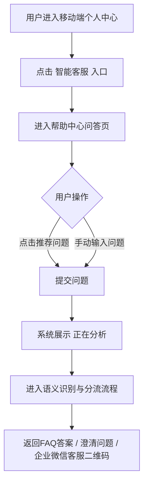
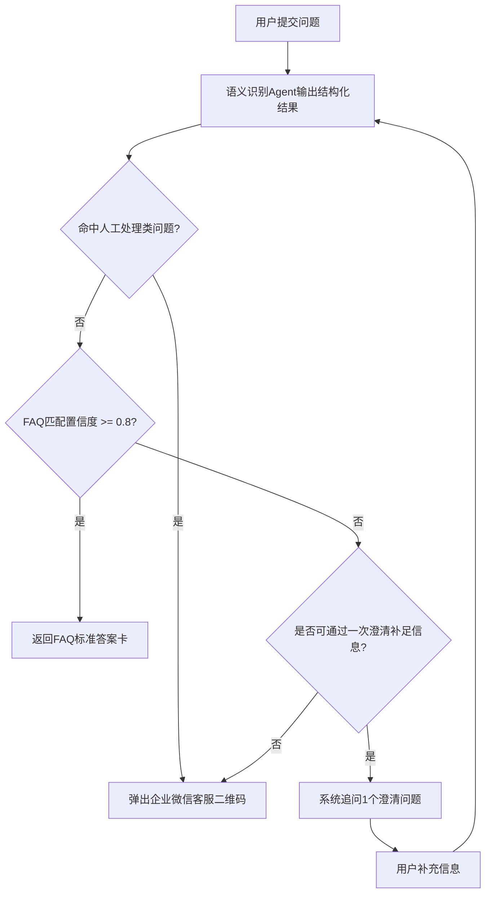
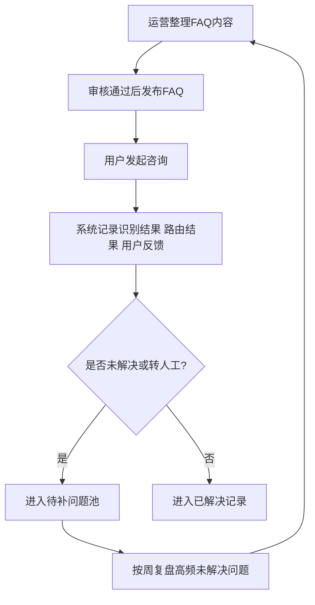
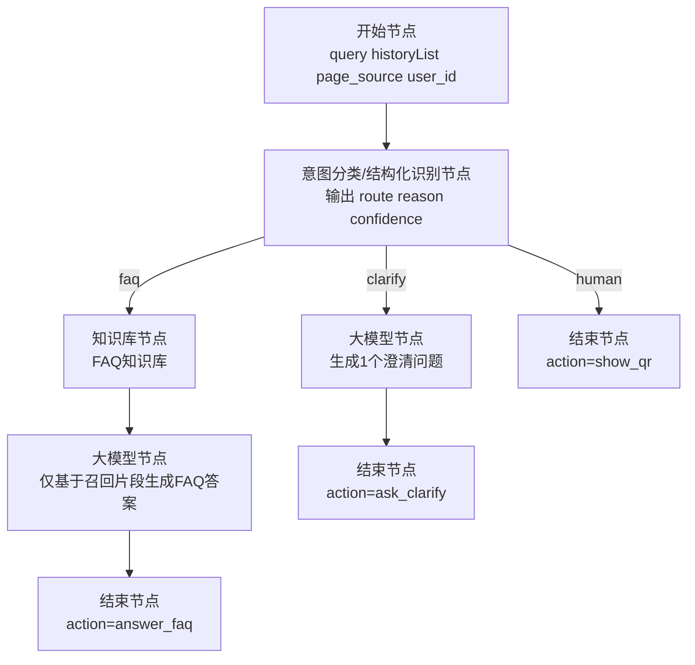

# 产品功能设计文档

## 文档信息

| 字段 | 内容 |
|------|------|
| 规划池记录 ID | 待补 |
| 产品规划摘要 | 新增 AI 服务助手（智能客服），基于语义识别实现 FAQ 直答、澄清追问与企业微信人工客服分流 |
| 设计日期 | 2026-04-08 |
| 状态 | 🤖 AI草稿（V0.1） |
| 目标模块文档 | AI服务助手模块.md（待创建） |

---

## 已确认设计决策（本版生效）

1. 首期交互以移动端文本问答为主，不纳入语音客服。
2. 首期仅在移动端个人中心提供统一的 `智能客服` 入口。
3. 智能客服的前台呈现采用 **方案 B：帮助中心页内嵌问答**，不单独做强 AI 助手对话框。

---

## 本版默认设计假设

1. 首期服务对象为保险合规培训平台个人用户，不扩展机构管理端能力。
2. 首期交互以移动端文本问答为主，不纳入语音客服。
3. 首期仅在移动端个人中心提供统一的 `智能客服` 入口。
4. 首期 FAQ 范围仅覆盖平台服务类问题，不覆盖保险产品推荐、保险条款解释、合规裁量结论；人工兜底方式为弹出企业微信客服二维码，不做站内在线人工会话。
5. AI 仅负责语义识别、FAQ 匹配和分流决策；最终直答内容必须来自已审核 FAQ，不允许脱离 FAQ 自由生成。

---

## 功能单元 1：智能客服入口与问答页

> 💡 **合并说明**: 本功能单元完成后，将“功能点描述”章节合并到 `AI服务助手模块.md` 中。

### 功能概述

为移动端用户提供统一的帮助入口，支持在个人中心快速发起咨询。首期以“高频 FAQ 自助解决 + 无法解决时引导人工”为核心，并采用“帮助中心外壳 + AI 语义分流内核”的方式落地，既保持原有产品风格，也能降低人工客服重复接待量。

---

### 业务流程

#### 流程图（文字版）

```text
用户进入移动端个人中心
      ↓
点击「智能客服」入口
      ↓
进入帮助中心问答页
      ↓
查看推荐问题或手动输入问题
      ↓
提交问题
      ↓
系统展示“正在分析”
      ↓
进入语义识别与分流流程
      ↓
返回FAQ答案 / 澄清问题 / 企业微信客服二维码
```

#### 流程图（Mermaid）



#### 业务规则

**触发条件**
- 用户点击页面内 `智能客服` 入口。
- 用户点击推荐问题卡片。
- 用户在输入框手动提交问题。

**处理逻辑**
1. 平台在移动端个人中心提供统一的 `智能客服` 入口。
2. 首次进入帮助中心问答页时，默认展示 4-6 个高频推荐问题。
3. 用户提交问题后，先展示处理中状态，再进入语义识别和 FAQ 分流。
4. 用户可在任意时点主动点击 `联系人工客服`，系统直接弹出企业微信二维码，不再经过 FAQ 识别。

**边界情况**
- 页面未登录时也允许打开客服入口，但仅支持通用 FAQ，不展示账号专属信息。
- 模型或检索超时超过 8 秒时，不继续等待，直接提示用户联系人工客服。
- 同一问题 2 次回答后用户仍点击 `没解决`，直接进入人工客服二维码弹窗。

---

### 原型设计

#### AI 初稿方案

**方案 A：AI 助手对话框**

```text
┌─────────────────────────────┐
│ ← AI 助手                   │
├─────────────────────────────┤
│ AI：请问需要什么帮助？       │
│ 你：学习记录为什么没更新？   │
│ AI：我来帮你查一下...        │
│                             │
│ [猜你想问] [证书问题]        │
├─────────────────────────────┤
│ [ 输入你的问题... ] [发送]  │
│ [联系人工客服]              │
└─────────────────────────────┘
```

说明：AI 感更强，但容易让用户误以为这是开放式助手，对能力预期会偏高。

**方案 B：帮助中心页内嵌问答（已选）**

```text
┌─────────────────────────────┐
│ ← 帮助中心                  │
├─────────────────────────────┤
│ 推荐问题                    │
│ [登录问题] [学习问题]       │
│ [支付问题] [证书问题]       │
│                             │
│ 智能问答                    │
│ AI：请问需要什么帮助？      │
│                             │
├─────────────────────────────┤
│ [ 输入你的问题... ] [发送]  │
│ [联系人工客服]              │
└─────────────────────────────┘
```

说明：外观仍是帮助中心，内部增加 AI 问答和分流能力，最符合当前“FAQ + 转人工”的真实能力边界。

**方案 C：底部弹层快捷问答**

```text
┌─────────────────────────────┐
│ 页面主内容                  │
│                             │
│                             │
├─────────────────────────────┤
│ 智能客服                    │
│ 推荐：学习记录没更新？      │
│ [ 输入你的问题... ] [发送]  │
│ [人工客服]                  │
└─────────────────────────────┘
```

说明：适合移动端，但展示信息量有限，不利于长对话。

已选方案：B。理由：你这期本质上是“增强版帮助中心”，不是开放式 AI 助手。用帮助中心承载，既不破坏原有样式，也更能管理用户预期。

---

### 功能点描述

> 📋 **合并目标**: 本章节内容在功能开发完成后，合并到 `AI服务助手模块.md` 的对应章节中。

---

#### 智能客服入口与帮助中心问答页

**入口路径**:
- 个人中心 → 智能客服

**页面名称**: `帮助中心-智能客服问答页`

**页面功能**:

1. **推荐问题区**:
   - 默认展示高频 FAQ 推荐问题。
   - 推荐问题按个人中心场景动态调整。
   - 个人中心入口优先展示账号、订单、学习记录、证书查询类问题。
   - 推荐问题池可补充支付、发票、登录异常、课程完成记录等高频问题。

2. **对话区**:
   - 展示 AI 服务助手回复内容。
   - 支持展示 FAQ 答案卡、澄清追问卡、人工客服引导卡。
   - 支持用户点击 `没解决` 反馈当前结果无效。

3. **输入区**:
   - 支持手动输入问题并发送。
   - 输入框下方常驻 `联系人工客服` 入口。
   - 发送后展示处理中状态，避免重复点击。

4. **反馈区**:
   - FAQ 直答后展示 `已解决` / `没解决` 两个反馈按钮。
   - 用户点击 `已解决` 后结束本次咨询。
   - 用户点击 `没解决` 后重新进入分流流程；如仍无法解决则引导人工。

**业务规则**:
- 智能客服入口在移动端个人中心固定显示，文案统一为 `智能客服`。
- 首次进入帮助中心问答页默认展示欢迎语与推荐问题，不自动发起咨询。
- 当前会话仅保留本次访问上下文，首期不提供历史会话列表。
- 未登录状态下不回答涉及个人账户、订单、学习记录的专属问题。

**待补充内容**:
1. 各页面推荐问题的具体题目池。
2. 帮助中心问答页在不同移动端机型下的尺寸规范。
3. 是否需要支持上传截图辅助问答。

---

### 验收标准

- [ ] 移动端个人中心可看到 `智能客服` 入口。
- [ ] 首次进入帮助中心问答页时可展示欢迎语和推荐问题。
- [ ] 用户输入问题后可看到处理中状态，且发送按钮防重复点击。
- [ ] FAQ 回复后必须提供 `已解决` 和 `没解决` 反馈入口。
- [ ] 用户可在任意时点主动点击 `联系人工客服` 直接查看企业微信客服二维码。
- [ ] 未登录状态下提问个人账户类问题时，不返回个人信息，只引导人工处理。

---

## 功能单元 2：FAQ 直答、澄清追问与企业微信分流

> 💡 **合并说明**: 本功能单元完成后，将“功能点描述”章节合并到 `AI服务助手模块.md` 中。

### 功能概述

由大模型承担语义识别职责，对用户问题进行意图判断、FAQ 匹配和人工分流决策。系统只在“已命中审核通过的 FAQ 且置信度足够高”时直答，其余问题通过澄清追问或弹出企业微信客服二维码兜底，避免答错。

---

### 业务流程

#### 流程图（文字版）

```text
用户提交问题
      ↓
语义识别Agent输出结构化结果
      ↓
判断是否命中人工处理类问题
      ↓是
弹出企业微信客服二维码
      ↓否
判断FAQ匹配置信度是否足够高
      ↓是
返回FAQ标准答案卡
      ↓否
判断是否可通过一次澄清补足信息
      ↓是
系统追问1个澄清问题
      ↓
用户补充信息后重新识别
      ↓否
弹出企业微信客服二维码
```

#### 流程图（Mermaid）



#### 业务规则

**触发条件**
- 用户手动输入问题并发送。
- 用户点击推荐问题卡片。
- 用户在澄清问题后补充说明。

**处理逻辑**
1. 语义识别 Agent 每次输出以下结构化结果：
   - 问题类别
   - 是否属于 FAQ 可答范围
   - FAQ 候选 ID
   - 置信度
   - 是否需要人工处理
   - 人工处理原因
2. 仅当同时满足以下条件时，系统才允许 FAQ 直答：
   - 命中 `已发布` 状态 FAQ；
   - 置信度 `>= 0.8`；
   - 不属于人工处理类问题；
   - 不涉及个人敏感数据查询或人工核验事项。
3. 当 FAQ 匹配置信度在 `0.6 ~ 0.79` 且可通过补充信息判断时，系统最多只允许追问 1 个澄清问题。
4. 发生以下任一情况时，系统直接弹出企业微信客服二维码：
   - 用户明确要求人工客服；
   - 问题涉及退款、投诉、订单纠纷、实名认证失败、账号异常、学习记录修正、证书申诉；
   - 问题涉及保险产品推荐、保险条款解释、合规判断结论；
   - FAQ 无匹配项；
   - 澄清后仍无法判断；
   - 模型识别失败或超时。
5. FAQ 直答后，回复内容必须展示：
   - 标准答案正文；
   - FAQ 分类标签；
   - `没解决？联系人工客服` 入口。

**边界情况**
- 用户连续两次输入高度模糊的问题，如“为什么不行”“还是有问题”，系统不再反复追问，直接转人工。
- 用户问题同时包含多个意图时，优先按人工处理类判断；如包含 `退款 + 课程学习`，直接转人工。
- 用户在未登录状态下咨询学习记录、证书状态等个人问题，系统不做猜测回答，直接引导人工处理。

---

### 原型设计

#### AI 初稿方案

**方案 A：会话内嵌人工引导卡**

```text
┌─────────────────────────────┐
│ AI：这个问题需要人工处理     │
│ 原因：涉及学习记录修正       │
│                             │
│ [ 企业微信二维码 ]          │
│ [ 复制客服企业微信号 ]      │
│ [ 返回继续提问 ]            │
└─────────────────────────────┘
```

说明：上下文连续，但二维码在小屏下展示空间有限。

**方案 B：弹窗展示企业微信二维码（推荐）**

```text
┌─────────────────────────────┐
│      联系企业微信客服        │
├─────────────────────────────┤
│ 该问题需要人工确认处理       │
│ 原因：涉及退款/账户异常      │
│                             │
│      [ 企业微信二维码 ]      │
│                             │
│ 客服时间：09:00-18:00        │
│ [复制企业微信号] [关闭]      │
└─────────────────────────────┘
```

说明：更符合“弹出二维码”的直觉，也便于强调这是人工处理链路。

**方案 C：跳转到联系客服页**

```text
┌─────────────────────────────┐
│ ← 联系客服                  │
├─────────────────────────────┤
│ 问题类型：账号异常          │
│ 请扫码联系企业微信客服      │
│ [ 企业微信二维码 ]          │
│ [ 复制企业微信号 ]          │
│ [ 返回智能客服 ]            │
└─────────────────────────────┘
```

说明：信息完整，但会打断当前问答节奏。

AI 推荐：B，理由：最符合用户心智，也最适合承接“语义识别后立即转人工”的动作。

---

### 功能点描述

> 📋 **合并目标**: 本章节内容在功能开发完成后，合并到 `AI服务助手模块.md` 的对应章节中。

---

#### FAQ 标准答案卡

**触发操作**:
- 用户问题命中可直答 FAQ，且满足直答条件。

**页面名称**: `帮助中心-智能客服问答页`

**页面功能**:

1. **答案内容区**:
   - 展示 FAQ 标准答案正文。
   - 答案内容只允许读取 FAQ 正文，不允许模型自行扩写新结论。
   - 可展示 `最后更新时间`，提醒内容时效。

2. **辅助信息区**:
   - 展示 FAQ 分类标签，如 `登录与账号`、`学习进度`、`证书问题`、`AI对练使用`。
   - 展示 `你可能还想问` 推荐问题。

3. **操作按钮**:
   - `已解决`：结束当前咨询。
   - `没解决`：进入二次判定；若仍无法解决则转人工。
   - `联系人工客服`：直接弹出企业微信客服二维码。

**业务规则**:
- FAQ 答案卡不展示模型推理过程。
- FAQ 答案正文与 FAQ 库保持一一对应，可追溯至 `faq_id`。
- 同一 `faq_id` 被停用后，系统不得继续返回该答案。

**待补充内容**:
1. FAQ 标签体系是否固定为一级分类。
2. 是否需要展示 FAQ 更新时间和版本号。

---

#### 企业微信客服二维码弹窗

**触发操作**:
- 用户主动要求人工客服。
- 系统判定问题需要人工处理。
- FAQ 二次判定后仍无法解决。

**页面名称**: `企业微信客服二维码弹窗`

**页面功能**:

1. **原因提示区**:
   - 告知用户当前问题需人工处理。
   - 展示转人工原因，如 `涉及退款`、`涉及账户异常`、`问题超出FAQ范围`。

2. **客服联系区**:
   - 展示企业微信客服二维码。
   - 展示客服在线时间。
   - 展示企业微信号文案，支持点击复制。

3. **补充操作区**:
   - `复制问题摘要`：复制当前咨询问题与系统识别的原因，减少用户重复描述成本。
   - `关闭`：关闭弹窗，返回当前问答页。

**业务规则**:
- 当前范围为移动端，除二维码外，必须提供 `复制企业微信号` 或 `长按保存二维码` 的替代方式。
- 弹窗关闭后保留当前会话内容，不清空已问问题。
- 企业微信二维码资源加载失败时，降级展示企业微信号和人工客服电话。

**待补充内容**:
1. 企业微信客服时间与节假日策略。
2. 是否区分售前、售后、技术支持多个二维码。
3. 问题摘要的字段范围和脱敏规则。

---

### 验收标准

- [ ] 语义识别结果可区分 `FAQ直答`、`澄清追问`、`人工处理` 三种路径。
- [ ] 仅当命中已发布 FAQ 且置信度达到阈值时，系统才可直答。
- [ ] FAQ 匹配中置信问题时，系统最多只追问 1 次澄清问题。
- [ ] 命中退款、投诉、账号异常、记录修正、保险专业咨询等问题时，系统直接转人工，不做 FAQ 直答。
- [ ] FAQ 直答内容可追溯到 `faq_id`，停用 FAQ 后不可继续返回。
- [ ] 企业微信二维码弹窗包含转人工原因、二维码、企业微信号复制入口。
- [ ] 在移动端无法扫码场景下，用户仍可通过复制企业微信号或保存二维码完成联系。

---

## 功能单元 3：FAQ 治理、日志留痕与待补问题池

> 💡 **合并说明**: 本功能单元完成后，将“功能点描述”章节合并到 `AI服务助手模块.md` 中。

### 功能概述

建立 FAQ 内容治理和咨询留痕机制，保证 AI 服务助手“只答已审核内容、答错可追溯、未解决问题可沉淀”，满足平台在合规和服务质量上的稳定运营要求。

---

### 业务流程

#### 流程图（文字版）

```text
运营整理FAQ内容
      ↓
审核通过后发布FAQ
      ↓
用户发起咨询
      ↓
系统记录识别结果、路由结果和用户反馈
      ↓
判断是否未解决或转人工
      ↓是
进入待补问题池
      ↓
按周复盘高频未解决问题
      ↓
补充/修订FAQ后重新发布
```

#### 流程图（Mermaid）



#### 业务规则

**触发条件**
- FAQ 内容新增、修改、停用。
- 用户每次提交问题。
- 用户点击 `已解决`、`没解决` 或进入人工客服。

**处理逻辑**
1. FAQ 内容必须维护以下基础字段：
   - `faq_id`
   - 标准问题
   - 同义问法
   - 标准答案
   - 适用范围
   - 是否允许 AI 直答
   - 状态（草稿 / 已发布 / 已停用）
   - 最近审核日期
2. 每次咨询必须记录以下日志字段：
   - 用户问题文本
   - 当前页面来源
   - 语义识别类别
   - 置信度
   - 命中的 `faq_id`
   - 路由结果（直答 / 澄清 / 人工）
   - 转人工原因
   - 用户反馈结果（已解决 / 没解决）
3. 下列问题自动进入待补问题池：
   - FAQ 无匹配导致转人工的问题；
   - 用户多次点击 `没解决` 的问题；
   - 高频重复出现但暂无标准答案的问题。
4. 首期不强制新建复杂运营后台，可接受通过表格导入或简单配置页维护 FAQ；但发布状态和审核日期必须可管理。

**边界情况**
- FAQ 被停用后，历史日志仍保留原 `faq_id`，但新咨询不得再命中该条 FAQ。
- 同一问题文本命中多个 FAQ 时，只保留最终返回的 `faq_id` 作为主记录，其余候选可进入调优日志。
- 涉及个人信息的日志导出需要脱敏处理。

---

### 功能点描述

> 📋 **合并目标**: 本章节内容在功能开发完成后，合并到 `AI服务助手模块.md` 的对应章节中。

---

#### FAQ 内容治理

**入口路径**:
- 无新增个人端页面；由运营配置能力维护 FAQ 内容。

**页面名称**: `FAQ配置能力（运营侧）`

**页面功能**:

1. **FAQ 内容维护**:
   - 新增、编辑、停用 FAQ。
   - 维护标准问题、同义问法、标准答案、分类标签、适用范围。

2. **发布控制**:
   - 仅 `已发布` 状态 FAQ 可被智能客服调用。
   - 保留审核日期和审核责任信息。

3. **直答权限控制**:
   - 对敏感 FAQ 设置 `不允许AI直答` 标识。
   - 敏感 FAQ 即使语义匹配成功，也只能引导人工。

**业务规则**:
- FAQ 内容修改后，新版本立即对后续咨询生效。
- FAQ 内容必须经过人工审核后才能发布。
- 涉及退款、投诉、记录修正等主题默认不允许 AI 直答。

**待补充内容**:
1. FAQ 配置采用独立后台页还是表格导入。
2. 审核责任人和发布流程是否接入现有权限系统。

---

#### 咨询日志与待补问题池

**触发操作**:
- 用户发起智能客服咨询。
- 用户点击结果反馈。
- 系统将问题转人工。

**页面名称**: `咨询日志与待补问题池（运营侧）`

**页面功能**:

1. **咨询日志记录**:
   - 记录每次咨询的识别结果、命中 FAQ、转人工原因和用户反馈。

2. **待补问题沉淀**:
   - 汇总 FAQ 未覆盖问题。
   - 汇总高频转人工问题。
   - 汇总用户点击 `没解决` 的问题。

3. **数据输出**:
   - 支持导出高频未解决问题清单，供 FAQ 运营迭代。

**业务规则**:
- 每条咨询日志都必须能追溯最终路由结果。
- 转人工问题必须有明确原因标签，不能只有“其他”。
- 高频未解决问题按周进入 FAQ 迭代评审。

**待补充内容**:
1. 高频问题的统计阈值。
2. 日志保留周期和导出权限。

---

### 验收标准

- [ ] FAQ 内容支持草稿、已发布、已停用三种状态。
- [ ] 仅已发布 FAQ 可被智能客服直答调用。
- [ ] 每次咨询均记录问题文本、识别类别、命中 FAQ、路由结果和用户反馈。
- [ ] FAQ 无匹配、用户多次 `没解决`、高频转人工问题可进入待补问题池。
- [ ] FAQ 停用后历史日志保留，但新咨询不可再命中。
- [ ] 导出的待补问题清单支持 FAQ 运营按周复盘。

---

## 设计依据说明

1. 依据 [保险合规培训平台-自由式无脚本对练V2-产品上下文.md](./保险合规培训平台-自由式无脚本对练V2-产品上下文.md) 的 `产品定位`、`设计原则`、`功能规划原则`：
   - 平台主链路是年度合规学习，新增 AI 功能应服务主链路且不制造合规风险。
   - 设计原则要求“合规优先于流畅”，因此本方案采用“可答才答，答不准就转人工”。
2. 依据 [AI学习助手三类能力-成本全景评估-v0.1.md](./AI学习助手三类能力-成本全景评估-v0.1.md) 中对 `AI服务助手` 的定义：
   - AI 服务助手的能力边界包括“常见问题、流程引导、人机转接、状态查询”。
   - 本方案优先落地“常见问题 + 人机转接”，暂不扩展复杂工单体系。
3. 依据 [保险合规培训平台-AI销售对练V2-领导汇报最终版-v1.0.md](./保险合规培训平台-AI销售对练V2-领导汇报最终版-v1.0.md) 中的技术原则：
   - 采用“规则引擎 + 知识库检索增强 + 大模型结构化输出”的落地方向。
   - 因此本方案中，大模型负责语义识别和结构化分类，FAQ 答案仍来自审核内容库。
4. 当前目录下未发现正式的 `保险合规培训平台*产品规划.md`，本方案先基于现有产品上下文和已存在专项文档形成设计草稿，待后续产品规划文档补齐后再统一同步。

---

## 附：阿里云百炼工作流落地建议

### 推荐实现方式

推荐采用 `百炼工作流应用 + 千问模型 + FAQ知识库 + 条件分支 + 前端弹企微二维码` 的组合方式落地，不建议把“FAQ直答”和“转人工”都交给单一智能体自由决策。

**推荐原因**:
- 当前业务本质是固定流程分流，不是开放式助手。
- FAQ 直答需要稳定、可控、可追溯。
- 转人工属于强约束动作，更适合规则分支，不适合主要依赖 RAG 猜测。

---

### 推荐节点图

#### 流程图（文字版）

```text
开始节点
  输入：query、historyList、page_source、user_id
      ↓
意图分类/结构化识别节点
  输出：route=faq / clarify / human
       reason
       confidence
      ↓
  ┌───────────────┬────────────────┬────────────────────┐
  │ route=faq     │ route=clarify  │ route=human        │
  ↓               ↓                ↓
知识库节点         大模型节点         结束节点
  FAQ知识库         生成1个澄清问题     输出 action=show_qr
      ↓               ↓                card_type=human_qr
大模型节点           结束节点           transfer_reason
  仅基于召回片段      输出 action=ask_clarify
  生成FAQ答案         card_type=clarify
      ↓
结束节点
  输出 action=answer_faq
  card_type=faq_answer
  answer_text
  confidence
```

#### 流程图（Mermaid）



---

### 节点设计建议

#### 节点1：开始节点

**输入变量建议**:
- `query`：用户当前问题。
- `historyList`：多轮上下文。
- `page_source`：页面来源，固定为 `profile_service_center`。
- `user_id`：用户标识，未登录可为空。
- `clarify_count`：已追问次数，首期限制为 `0/1`。

**说明**:
- `page_source` 便于后续做日志统计和推荐问题调优。
- `clarify_count` 用于限制最多只澄清一次，避免反复追问。

---

#### 节点2：意图分类/结构化识别节点

**推荐实现**:
- 优先方案：使用百炼 `意图分类` 节点，把问题先分成 `FAQ可答`、`需要澄清`、`必须人工处理` 三类。
- 增强方案：在意图分类后串一个 `大模型` 节点，输出结构化 JSON，补充 `reason`、`confidence`、`human_reason_code`。

**推荐输出结构**:

```json
{
  "route": "faq",
  "reason": "命中学习记录FAQ",
  "confidence": 0.92,
  "human_reason_code": "",
  "clarify_question": ""
}
```

**分类口径建议**:
- `faq`：平台规则明确、答案稳定、无需人工核验。
- `clarify`：信息不够，但补问 1 次有机会落到 FAQ。
- `human`：退款、投诉、账号异常、学习记录修正、证书申诉、保险专业咨询、用户明确要求人工。

**Prompt 要点**:
- 只做路由判断，不直接回答用户问题。
- 遇到高风险或需人工核验问题，优先输出 `human`。
- 当 `clarify_count >= 1` 时，不再输出 `clarify`，直接输出 `human`。

---

#### 节点3：FAQ 知识库节点

**推荐方式**:
- 仅在 `route=faq` 时调用知识库。
- FAQ 分支建议使用 `知识库` 节点，而不是让所有问题都先查知识库。

**调用方式建议**:
- 当前分支已经判定为 FAQ，可优先使用 `必定调用`。
- 如果后续 FAQ 覆盖范围变复杂，再评估是否改为 `智能调用`。

**知识库类型建议**:
- 优先使用 `表格知识库` 管理 FAQ。

**FAQ 表结构建议**:
- `faq_id`
- `category`
- `standard_question`
- `aliases`
- `answer_text`
- `can_ai_answer`
- `updated_at`
- `status`

**这样设计的原因**:
- 便于返回 `faq_id`，满足日志留痕和答案追溯。
- 便于设置 `can_ai_answer=false`，把敏感 FAQ 直接挡到人工分支。

---

#### 节点4：FAQ 答案生成节点

**作用**:
- 不是自由回答，而是把知识库召回结果整理成前端可展示的答案卡。

**Prompt 约束建议**:
- 只能使用知识库召回片段中的信息回答。
- 不允许补充召回片段中没有的承诺、判断或结论。
- 若召回片段不足以回答，返回 `insufficient_info=true`，由后续转人工。

**推荐输出结构**:

```json
{
  "action": "answer_faq",
  "card_type": "faq_answer",
  "faq_id": "FAQ-0012",
  "category": "学习记录",
  "answer_text": "课程完成后，学习记录通常会在5分钟内更新。",
  "suggested_questions": [
    "证书在哪里查看？",
    "为什么显示未完成？"
  ]
}
```

---

#### 节点5：澄清问题生成节点

**作用**:
- 仅在 `route=clarify` 时生成 1 个澄清问题。

**规则建议**:
- 一次只问 1 个问题。
- 问法尽量封闭，便于用户快速补充。
- 不能连续澄清超过 1 次。

**示例**:
- 用户说：`学完怎么还是不对`
- 澄清问题：`你遇到的是“学习记录未更新”，还是“证书未显示完成”？`

**推荐输出结构**:

```json
{
  "action": "ask_clarify",
  "card_type": "clarify",
  "clarify_question": "你遇到的是学习记录未更新，还是证书未显示完成？"
}
```

---

#### 节点6：转人工结束节点

**作用**:
- 不需要模型再生成自然语言长答案，直接输出前端卡片数据。

**推荐输出结构**:

```json
{
  "action": "show_qr",
  "card_type": "human_qr",
  "transfer_reason": "学习记录修正需人工核验",
  "qr_type": "after_sales",
  "wechat_id": "xxx_service",
  "service_time": "09:00-18:00"
}
```

**说明**:
- 如果后续要区分 `售前 / 售后 / 技术支持`，建议用 `qr_type` 做映射。
- 这个映射更适合放在配置表、API 或 MCP 工具中，不建议当作自由文本知识库来召回。

---

### 关于“客服直转库”的建议

可以有“客服直转规则配置”，但不建议把它当成和 FAQ 一样的 RAG 知识库来使用。

**更推荐的做法**:
- FAQ：放在 `FAQ知识库`。
- 转人工规则：放在 `意图分类标签 + 配置表/API`。
- 二维码信息：放在 `配置表/API/MCP`，按 `qr_type` 返回。

**不建议把转人工做成普通知识库的原因**:
- 转人工规则是强约束，不是开放检索。
- RAG 适合召回答案，不适合做“必须转人工”的最终裁决。
- 一旦 FAQ 和转人工规则混在同一个知识库里，容易出现误召回和误答。

---

### 模型建议

**MVP 推荐**:
- 路由识别：`qwen-flash` 或同档低成本模型。
- FAQ 答案整理：`qwen-plus-latest`。

**原因**:
- 路由识别主要是分类，成本应尽量低。
- FAQ 答案整理需要更稳定的表达和格式控制，可使用更稳一点的模型。

**补充说明**:
- 如果你希望结构化输出更稳，建议在分类和答案整理节点都使用 JSON 输出格式。
- 不建议在本场景开启思考模式，以免增加延迟和不确定性。

---

### 数据与日志提醒

**建议自行落库保存以下字段**:
- `session_id`
- `user_id`
- `query`
- `route`
- `confidence`
- `faq_id`
- `transfer_reason`
- `page_source`
- `user_feedback`
- `created_at`

**原因**:
- 百炼工作流平台内的对话记录保留期有限，不适合作为长期业务审计库。
- 当前业务需要看 FAQ 命中率、转人工率、未解决问题池，这些都需要你们业务侧自己持久化。

---

## 附：本版待你确认的 6 项

1. 个人中心入口采用 `固定功能位`、`列表项入口` 还是 `帮助与客服卡片`。
2. FAQ 范围是否包含 `支付/退款规则说明`，还是这类问题全部直接转人工。
3. 企业微信客服是使用单一二维码，还是按 `售前 / 售后 / 技术支持` 分多个二维码。
4. 转人工弹窗是否需要增加 `复制问题摘要` 功能。
5. FAQ 内容维护首期采用 `表格导入` 还是 `轻量后台页`。
6. FAQ 运营复盘频率按周还是按双周。
